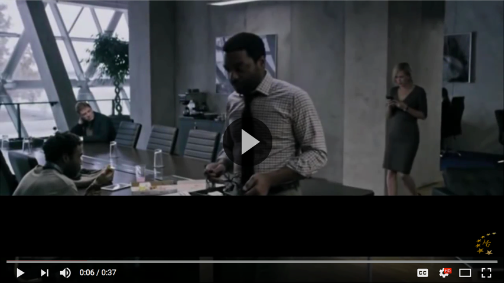

# Project-Durins-Folk

```
Project Durin's Folk
|
|-- Argonath - Login / Gate keeper
|    |-- ..
|-- Celebdil - Backend repo
|    |-- ..
|-- Dwimorberg - Database
|    |-- Dimholt - Application db
|    |-- Dunharrow - User Authentication
|-- Mirrormere - Frontend repo
|    |-- ..
|-- Morannon - Other
    |-- ..
```

#### Links:
* [Invision Prototype](https://invis.io/QRHS8AZH3MF)
* [CodeFactor](https://www.codefactor.io/repository/github/eglarest/project-durins-folk)

## Code Styles (prefered best practices)

Best Practices:
* no lines over 140 characters
* no .* imports
* use String.format(...) if more than 1 variable in String expression
* use SOLID principles (When you can)
* don't repeat code; if you're duplicating, pull it out into it's own method

Suggestions:
* 1 space between ) and {
* never more than 1 blank line
* no blank lines at the end of a method/class

Note:
* Can use `.eslintrc.json` for auto formating
  * For ESLint IntelliJ editor plugin go [here](https://www.jetbrains.com/help/idea/eslint.html)
  * For ESLint Atom editor plugin go [here](https://atom.io/packages/linter-eslint)
* Edit the ESLint file to reflect prefered best practice changes

## Git help

### Git Workflow: (to help minimize growing pains with git)

1. Begin on local/master branch
2. `git pull`
3. `git checkout -b yourName/newBranchName`
4. make changes and test changes
5. `git add <all changes>` (git add Celebdil/src/* often works)
6. `git commit -a -m "Description of work"`
7. `git rebase -i master` **ONLY IF MORE THAN 1 COMMIT IN BRANCH**
  * this should open a text editor
  * change all commits EXCEPT the first from "pick" to "squash"
  * save and exit ('Esc' then :wq in vim)
  * this should bring up a second text editor
  * delete all commit messages except one, leaving the one describing what your changes are
  * save and exit
8. `git checkout master`
9. `git pull`
10. `git checkout yourName/newBranchName`
11. `git rebase master`
  * you may need to resolve some git conflicts:
  * git status will tell you the files
  * edit the files to choose the changes you want
  * git rebase --continue
12. `git checkout master`
13. `git pull`
  * if this says 'Already up to date.' continue.
  * if not return to step 10.
14. `git merge yourName/newBranchName`
15. `git push`
16. You can chose to clean up your local git if you wish
  * `git branch -d newBranchName` **This will delete your old working branch**


### Git Workflow: (With Pull Request)
1. Begin on up to date local/master branch
  * `git checkout master`
  * `git pull`
2. Create your own branch to make and test changes
  * `git checkout -b yourName/newBranchName`
3. Make changes and test changes
4. Commit and push changes to your branch
  * `git add <changes>`
    - `git add projectSubDirectoryName/src/*` often works
    - `git add -A` adds everything
  * `git commit -a -m "Description of work"`
  * `git push`
5. While working on the branch keep up to date with master using **merge**
  * `git checkout master`
  * `git pull`
  * `git checkout yourName/newBranchName`
  * `git merge master`
    - fix any merge conflicts
  * `git push`
6. Create pull request
  * Go to your branch on [github](https://github.com/Eglarest/Project-Durins-Folk/branches)
  * Click the create pull request button
  * Describe changes
7. Decide if we are `squashing and merging` or s`quashing and rebasing`
  * click the button for whichever is decided
8. Delete the old branch
  * `git branch -d newBranchName` **This will delete your old working branch**
  * Or use the button on github
9. Go back to master. rinse and repeat.

### If you messed up

git reset HEAD^ - will undo 1 commit

If you made changes directly to your master branch:
* git stash save
* git checkout -b newBranchName
* git stash apply

#### Confused by naming choices?

[](https://youtu.be/_YmDT2BgI-0?t=6)


### Names

- Eglarest
- Nargothrond
-
